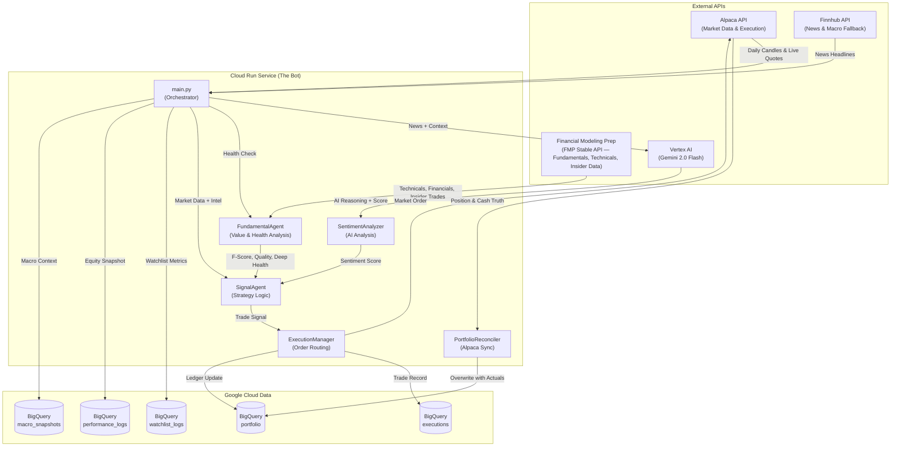

# System Architecture: Autonomous Trading Bot

This document outlines the architecture, components, and logic of the autonomous trading system currently deployed on Google Cloud Platform (GCP).

## 1. High-Level Overview

The system is a cloud-native, event-driven trading bot designed to:
1.  **Ingest Market Data**: Historical prices (Alpaca) and News (Finnhub).
2.  **Analyze**: Compute technical indicators, AI-driven sentiment, and fundamental health.
3.  **Decide**: Generate BUY/SELL/HOLD signals based on a hybrid technical + fundamental strategy.
4.  **Execute**: Place paper trades via Alpaca and update the internal BigQuery ledger.
5.  **Reconcile**: Sync the BigQuery ledger against Alpaca's source-of-truth after each cycle.
6.  **Track**: Persist all data, decisions, and performance metrics to BigQuery and Cloud Monitoring.

## 2. Architecture Diagram

## 3. Core Components

### A. Orchestrator (`main.py`)
- **Role**: The central nervous system.
- **Function**:
    - Initializes all managers and API clients.
    - Runs the watchlist: `TSLA, NVDA, MU, AMD, PLTR, COIN, META, MSTR` (configurable via `BASE_TICKERS` env var).
    - Fetches data in parallel: Alpaca candles, FMP technicals, Finnhub news, fundamental health, macro context.
    - Coordinates: Data → Signal → Execution → Logging.
    - Exposes `/equity` endpoint for real-time live portfolio equity (bypasses stale logs).
    - Calculates and logs total portfolio equity at the end of each cycle.

### B. Signal Agent (`signal_agent.py`)
- **Role**: The strategist.
- **Logic**: Hybrid Technical + Fundamental + Sentiment pipeline.
- **Strategy Pipeline**:
    1.  **Holiday Filter**: Skips processing if the market is closed.
    2.  **Volatility Gate**: Skips trading if Bollinger Band width > threshold (default 25%, relaxed 50% when exposure is low).
    3.  **Exit Override** (runs before buy signals):
        - **Profit Target**: SELL if profit ≥ 5%.
        - **Stop Loss**: SELL if loss ≥ 2.5%.
        - **Sentiment Exit**: SELL if Sentiment < -0.4.
        - **RSI Overbought Exit**: SELL if RSI ≥ 80.
    4.  **Technical Baseline**:
        - BUY if `Price ≤ Lower Band` AND Sentiment ≥ 0.4.
        - SELL if `Price ≥ Upper Band`.
        - RSI Oversold Aggression: BUY if RSI ≤ 30 AND Sentiment > 0.4.
    5.  **Low Exposure Aggression** (`PROACTIVE_WARRANTED_ENTRY`): If portfolio < 65% invested, allows HOLD-technical BUY if Sentiment ≥ 0.2 and AI Confidence ≥ 70.
    6.  **Fundamental Gatekeeper**: Blocks BUY if F-Score is critically low or basic health fails.
    7.  **Star Rating**: Flags elite opportunities (AI ≥ 90, F-Score ≥ 7, deeply healthy).

### C. Execution Manager (`execution_manager.py`)
- **Role**: The trader.
- **Function**:
    - Validates `PortfolioManager` for sufficient Cash (BUY) or Holdings (SELL).
    - Submits **Market Orders** to Alpaca (Paper Trading mode).
    - Records every trade to `trading_data.executions` in BigQuery.

### D. Portfolio Manager (`portfolio_manager.py`)
- **Role**: The accountant.
- **Function**:
    - Manages the internal BigQuery ledger (`trading_data.portfolio`).
    - **Unified Cash Pool**: Single 'USD' row holds all purchasing power.
    - **Asset Tracking**: Tracks holdings and **Weighted Average Cost (WAC)** per ticker.
    - **Equity Calculation**: `Total Equity = Cash + (Holdings × Current Price)`.

### E. Portfolio Reconciler (`portfolio_reconciler.py`)
- **Role**: The auditor.
- **Function**:
    - Runs at the **start** of every audit cycle and **after trades execute**.
    - Overwrites the BigQuery `portfolio` table with Alpaca's actual cash and positions.
    - Syncs `executions` table with real fill prices and quantities from Alpaca.
    - Prevents ledger drift from slippage, fees, or missed signals.

### F. Sentiment Analyzer (`sentiment_analyzer.py`)
- **Role**: The news analyst.
- **Function**:
    - Uses Google's **Gemini 2.0 Flash** via Vertex AI.
    - Synthesizes news headlines, RSI, SMA stretch, analyst consensus, and **Insider Trading Momentum** into a score (-1.0 to +1.0).
    - Returns a reasoning string explaining the score.

### G. Fundamental Agent (`fundamental_agent.py`)
- **Role**: The value investor.
- **Primary Source**: **Financial Modeling Prep (FMP) Stable API**.
- **Function**:
    - **Basic Health**: PE Ratio and EPS checks (via FMP + Finnhub fallback).
    - **Deep Health** (Piotroski F-Score): Analyzes income, balance sheet, and cash flow statements (annual, 2-year).
    - **Technical Indicators**: RSI, SMA-20, SMA-50 via FMP stable endpoints.
    - **Intelligence Metrics**: Analyst estimates, price-target consensus, and **Insider Trading Momentum** (Buy vs Sell ratio from the last 100 insider trades).
    - **Macro Context**: VIX, SPY/QQQ performance, treasury rates, economic calendar.
    - **Caching**: Results are cached in BigQuery to reduce API calls; bypassed when `force_refresh=True`.

### H. Ticker Ranker (`ticker_ranker.py`)
- **Role**: The pre-market filter.
- **Function**: Runs a daily 9:15 AM ET job to establish a "Confidence Baseline" (AI Conviction Score) for all tickers before trading opens.

### I. Feedback Agent (`feedback_agent.py`)
- **Role**: The learner.
- **Function**: Post-cycle hindsight analysis; generates "lessons learned" that influence future sentiment scoring.

## 4. Key Data Flows

1.  **Phase 0 — Reconciliation**: `PortfolioReconciler` syncs BigQuery ← Alpaca.
2.  **Phase 1 — Intelligence Gathering**: Parallel fetch of quotes, news, fundamentals, confidence, macro for all tickers.
3.  **Phase 2 — Portfolio Analysis**: Identifies Weakest Link (held laggard) and Rising Star (non-held leader).
4.  **Phase 3 — Execution**: SELLs first (to free cash), then BUYs. Conviction swaps where justified.
5.  **Phase 4 — Post-Trade Reconciliation**: 45s wait for Alpaca fills, then re-sync.
6.  **Phase 5 — Reflection**: Feedback Agent logs hindsight analysis.

## 5. Infrastructure (Terraform)

- **Cloud Run**: Hosts the Python bot container (`trading-audit-agent`).
- **Cloud Scheduler**: Triggers the bot via HTTP POST on a schedule.
- **BigQuery**: Warehouses all structured data (Tables: `portfolio`, `executions`, `watchlist_logs`, `performance_logs`, `macro_snapshots`).
- **Secret Manager**: Stores API Keys (`FMP_KEY`, `ALPACA_API_KEY`, `ALPACA_API_SECRET`, `EXCHANGE_API_KEY`).
- **Cloud Monitoring**: Custom dashboard (`Aberfeldie Node: NASDAQ Monitor`) with aggregated log-based metrics.
